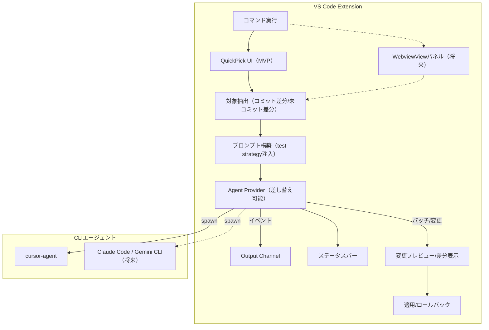
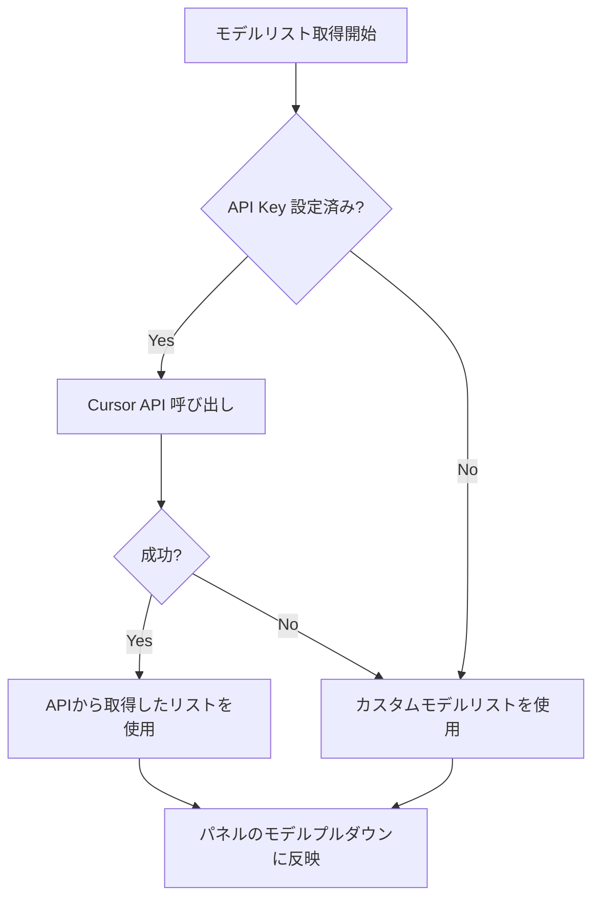

---name: テスト生成エージェント拡張機能overview: Cursor CLI（cursor-agent）をヘッドレスモードで非同期呼び出しし、コミット差分や選択範囲からテストコードを自動生成するVS Code拡張機能を実装する。todos:

# ========================================

# MVP (Phase 1): 型定義 + 基盤（依存少・エージェント向き）

# ========================================

- id: mvp-types

content: "[MVP] 共通型定義（event.ts: TestGenEvent, provider.ts: Provider interface）"status: pending

- id: mvp-output-channel

content: "[MVP] Output Channel 管理モジュール（ui/outputChannel.ts）"status: pending

- id: mvp-preflight

content: "[MVP] プリフライトチェック（CLI存在確認、設定検証）"status: pending

- id: mvp-cursor-provider

content: "[MVP] cursor-agent Provider実装（spawn + stream-json パース）"status: pending

- id: mvp-prompt-builder

content: "[MVP] プロンプト構築（test-strategy.md読み込み + テンプレート組み立て）"status: pending

- id: mvp-generate-cmd

content: "[MVP] テスト生成コマンド実装（generateTestFromCommit）"status: pending

# ========================================

# Phase 2: Git連携 + 差分ソース拡張

# ========================================

- id: phase2-git-diff

content: git diff 解析モジュール（git/diffAnalyzer.ts）status: pending

- id: phase2-commit-range

content: コミット範囲指定コマンド（generateTestFromCommitRange）status: pending

- id: phase2-working-tree

content: 未コミット差分コマンド（generateTestFromWorkingTree: staged/unstaged）status: pending

- id: phase2-snapshot

content: 開始時スナップショット取得（core/snapshot.ts）status: pending

# ========================================

# Phase 3: UX改善（QuickPick優先、Webview後回し）

# ========================================

- id: phase3-statusbar

content: ステータスバー進捗表示（ui/statusBar.ts）status: pending

- id: phase3-quickpick

content: QuickPickでソース/モデル選択UI（ui/quickPick.ts）★Webviewより先status: pending

- id: phase3-model-settings

content: モデル設定（設定画面 + customModelsフォールバック）status: pending

- id: phase3-diff-preview

content: 変更プレビュー/適用/ロールバック（apply/diffPreview.ts, patchApplier.ts）status: pending

- id: phase3-batch

content: 複数ファイル並列処理（maxParallelTasks制限）status: pending

# ========================================

# Phase 4: 高度な機能（後回し）

# ========================================

- id: phase4-webview-panel

content: "[後回し] TestGen操作パネル（WebviewView）"status: pending

- id: phase4-model-fetch

content: Cursor API (GET /v0/models) からモデルリスト動的取得status: pending

- id: phase4-worktree-sandbox

content: "[任意] git worktree サンドボックス実行"status: pending

# ========================================

# Phase 5: カバレッジ連携（将来）

# ========================================

- id: phase5-coverage-analyzer

content: "[将来] カバレッジレポート解析（coverage/coverageAnalyzer.ts）"status: pending

- id: phase5-coverage-cmd

content: "[将来] カバレッジ不足箇所からのテスト生成コマンド"status: pending

# ========================================

# Phase 6: 品質評価（将来）

# ========================================

- id: phase6-quality-eval

content: "[将来] 生成テストの品質評価（実行・カバレッジ・モデル比較）"status: pending

- id: phase6-prompt-tuning

content: "[将来] 評価結果に基づくプロンプト改善"status: pending---

# テスト生成エージェント拡張機能

## 概要

Cursor CLI (`cursor-agent`) をヘッドレスモード (`-p`) でバックグラウンド実行し、テストコード生成を非同期に行うVS Code拡張機能。生成結果はデフォルトでDiffプレビューしてから適用でき、進捗はOutput Channelでリアルタイム確認可能。

### MVPの目標

**「最新コミット差分からテスト生成」が動く最小構成**を最優先で実装。QuickPickでソース/モデルを選択し、cursor-agentを呼び出してテストを生成する。

### 実装方針

- エージェント（AI）に書かせやすい順序で実装
- 依存が少なく入出力が明確なモジュールから攻める
- WebviewViewパネルは複雑なため後回し（QuickPickをMVPのUIとする）
- 各モジュールを書いたらF5でデバッグ実行して確認

## アーキテクチャ



> 実線 = MVP、破線 = 将来実装

## ディレクトリ構成

```javascript
src/
├── extension.ts                 # エントリーポイント
├── commands/
│   ├── generateFromCommit.ts      # [MVP] 最新コミット差分からテスト生成
│   ├── generateFromCommitRange.ts # 指定範囲のコミット差分からテスト生成
│   └── generateFromWorkingTree.ts # 未コミット差分（staged/unstaged）からテスト生成
├── core/
│   ├── event.ts                 # [MVP] 共通イベント定義（TestGenEvent）
│   ├── preflight.ts             # [MVP] CLI存在確認・設定検証
│   ├── promptBuilder.ts         # [MVP] test-strategy注入/プロンプト組み立て
│   ├── taskManager.ts           # 実行中タスクの管理
│   ├── snapshot.ts              # 実行開始時のワークツリースナップショット
│   └── modelSettings.ts         # モデル設定管理
├── git/
│   ├── diffAnalyzer.ts          # git diff 解析ユーティリティ
│   └── worktreeManager.ts       # [将来] git worktree サンドボックス管理
├── coverage/
│   └── coverageAnalyzer.ts      # [将来] カバレッジレポート解析（lcov/json）
├── providers/
│   ├── provider.ts              # [MVP] Provider interface + capabilities
│   ├── cursorAgentProvider.ts   # [MVP] cursor-agent 実装
│   ├── claudeCodeProvider.ts    # [将来] Claude Code 実装
│   └── geminiCliProvider.ts     # [将来] Gemini CLI 実装
├── apply/
│   ├── diffPreview.ts           # 変更プレビュー（VS Code Diff）
│   └── patchApplier.ts          # 適用/ロールバック
└── ui/
    ├── outputChannel.ts         # [MVP] Output Channel 管理
    ├── statusBar.ts             # ステータスバー表示
    ├── quickPick.ts             # [MVP] QuickPickでソース/モデル選択
    └── controlPanel.ts          # [将来] WebviewView操作パネル
```

## 主要コマンド

| コマンドID | 機能 | Phase |

|-----------|------|:-----:|

| `testgen-agent.generateTest` | QuickPickでソース/モデル選択して実行 | MVP |

| `testgen-agent.generateTestFromCommit` | 最新コミットの変更に対するテスト生成 | MVP |

| `testgen-agent.showTestGeneratorOutput` | Output Channel を表示 | MVP |

| `testgen-agent.generateTestFromCommitRange` | 指定したコミット範囲の差分に対するテスト生成 | Phase 2 |

| `testgen-agent.generateTestFromWorkingTree` | 未コミット差分に対するテスト生成 | Phase 2 |

| `testgen-agent.selectDefaultModel` | デフォルトモデルを変更 | Phase 3 |

| `testgen-agent.previewLastRun` | 直近生成の変更差分を表示 | Phase 3 |

| `testgen-agent.rollbackLastRun` | 直近生成の変更を取り消す | Phase 3 |

| `testgen-agent.openTestStrategy` | テスト戦略ルールファイルを開く | Phase 3 |

| `testgen-agent.openPanel` | WebviewViewパネルを開く | Phase 4 |

| `testgen-agent.generateTestFromCoverage` | 未カバー行/関数に対するテスト生成 | Phase 5 |

## 設定項目 (contributes.configuration)

- `testgen-agent.cursorApiKey` (string): Cursor API Key（環境変数 `CURSOR_API_KEY` も可）
- `testgen-agent.defaultModel` (string): デフォルトで使用するモデル
- `testgen-agent.customModels` (string[]): カスタムモデルリスト（動的取得失敗時のフォールバック）
- `testgen-agent.uiMode` (string): UIモード（`panel`=操作パネル / `quickPick`=QuickPick）。デフォルト: `panel`
- `testgen-agent.provider` (string): 使用するCLI Provider（`cursor-agent` / `claude-code` / `gemini-cli`）。デフォルト: `cursor-agent`
- `testgen-agent.applyMode` (string): 生成結果の適用モード（`preview`=差分プレビューしてから適用 / `auto`=自動適用 / `none`=適用しない）。デフォルト: `preview`
- `testgen-agent.cursorAgentPath` (string): `cursor-agent` コマンドパス（未指定ならPATHから解決）
- `testgen-agent.maxParallelTasks` (number): 複数ファイル処理の同時実行数上限
- `testgen-agent.testStrategyPath` (string): テスト戦略ルールファイルのパス（デフォルト: `docs/test-strategy.md`）
- `testgen-agent.includeTestPerspectiveTable` (boolean): テスト観点表を生成するか（デフォルト: true）
- `testgen-agent.coverageReportPath` (string): カバレッジレポート（lcov.info等）のパス（デフォルト: `coverage/lcov.info`）

## UI戦略

### Phase 3: QuickPick（MVP）★先に実装

QuickPickは実装が簡単で、エージェント生成に向いている。MVPではQuickPickを使用し、動作確認を優先する。

```javascript
[コマンド実行] → [ソース選択 QuickPick] → [モデル選択 QuickPick] → [実行]
```

**QuickPickで選択する項目:**

- **Source**: `最新コミット差分` / `コミット範囲差分` / `未コミット差分(staged)` / `未コミット差分(unstaged)`
- **Model**: 設定のcustomModelsから選択（将来: API動的取得）

### Phase 4: WebviewView パネル（後回し）

複数の選択状態を常に可視化したい場合は、WebviewViewパネルを実装。ただし HTML/CSS/JS + メッセージングが複雑なため、MVPが動いてから取り組む。**パネルに含める要素（将来）:**

- Source / Provider / Model / ApplyMode のプルダウン
- 操作ボタン: `生成` / `差分表示` / `適用` / `ロールバック` / `Outputを開く`
- 状態表示: 実行中/完了/エラー、直近Runの対象・モデル・変更ファイル数

## Cursor CLI 呼び出し方式

ヘッドレスモードで非同期実行:

```bash
cursor-agent -p --model "claude-3.5-sonnet" --output-format stream-json "プロンプト"
```

- `-p`: 非対話モード（print mode）
- `--force`: ファイル変更を自動適用（`applyMode=auto` の場合のみ付与する想定）
- `--model`: 使用するモデルを指定（UIで選択したモデル）
- `--output-format stream-json`: リアルタイム進捗をJSONストリームで取得

### 安全性（プレビュー/ロールバック）方針

Rulesやスラッシュコマンドでも近いことは可能だが、ポータビリティと安全性の観点で拡張機能側の統合UXが価値になる。

- **デフォルトは `applyMode=preview`** とし、生成結果はまず変更プレビュー（Diff）で確認してから適用する
- Providerが「パッチ/変更案」を直接返せない場合は、実行前後の差分（例: git diff、または拡張機能が取るスナップショット）で変更を可視化する
- 取り消し手段を用意する（例: 変更前バックアップから復元、gitが利用可能なら該当ファイルの復元）
- 直近実行の「変更セット」（変更ファイル一覧/差分/バックアップ）を保存し、プレビュー/ロールバックコマンドで再利用する
- 実行前の **プリフライトチェック**（CLI未導入、API Key未設定、モデル未取得、作業ツリーが大きく汚れている等）を行い、次のアクション付きで案内する

### 非同期実行におけるワークツリー（作業ツリー）対応

非同期生成中にユーザの編集が進む前提で、「どの状態を基準に差分を取り、どの状態に戻せるか」を拡張機能が保持する。

- **開始時スナップショット**: タスク開始時点の対象ファイル内容（およびハッシュ）を保存し、以後の差分/ロールバックの基準にする
- **適用前の競合検知**: 適用直前に現在のファイル内容がスナップショットから変化している場合は競合として扱う
- `applyMode=auto` でも競合時は `preview` にフォールバックし、Diffで確認できるようにする
- 競合が解消できない場合は「最新状態で再生成」を案内する
- **サンドボックス実行（任意）**: Providerが実ファイル変更（`--force` 等）を前提とする場合、`git worktree` で一時ワークツリーを作り、その中で実行して差分を抽出する（実ワークツリーは汚さない）
- 作業ツリーがdirtyの場合は、開始時の差分（および必要な未追跡ファイル）をサンドボックスへ反映してから実行する
- 実行後は差分（patch）だけを本体へ持ち帰り、ワークツリーはクリーンアップする

## テスト戦略ルールの組み込み

テスト生成時のプロンプトに [docs/test-strategy.md](docs/test-strategy.md) のルールを自動適用する。

### 言語設定（回答/コメント/観点表）

`docs/test-strategy.md` 先頭の `testgen-agent-config` から、出力言語を読み込む。

- `answerLanguage`: 生成時の説明文（テーブル以外の自然言語）
- `commentLanguage`: テストコード内コメント（Given / When / Then を含む）
- `perspectiveTableLanguage`: テスト観点表（Markdown）の言語

未設定・解析失敗時は `ja` にフォールバックする。

### 生成プロンプトに含める要素

1. **テスト観点表の生成**

- テストコード実装前に Markdown 形式のテスト観点表を作成
- 列: `Case ID`, `Input / Precondition`, `Perspective (Equivalence / Boundary)`, `Expected Result`, `Notes`
- 正常系・異常系・境界値（0 / 最小値 / 最大値 / ±1 / 空 / NULL）を網羅

2. **テストコード実装ポリシー**

- 正常系と同数以上の失敗系を含める
- 分岐網羅率 100% を目標
- 不正な型・形式の入力、外部依存の失敗もカバー

3. **Given / When / Then コメント**

- 各テストケースに必須のコメントフォーマット

4. **例外・エラー検証**

- 例外の型とメッセージを明示的に検証

### プロンプトテンプレート例

```text
以下のファイルに対するユニットテストを生成してください。

## 出力言語（必須）
- 説明文（テーブル以外）: {answerLanguage}
- テストコード内コメント: {commentLanguage}
- テスト観点表（Markdown）: {perspectiveTableLanguage}

## テスト戦略ルール（必須）
1. まずテスト観点表（Markdown）を作成する
2. 正常系・異常系・境界値を網羅する
3. 正常系と同数以上の失敗系を含める
4. 各テストに Given / When / Then コメントを付与
5. 例外の型とメッセージを明示的に検証

## テスト観点表テンプレート
| Case ID | Input / Precondition | Perspective | Expected Result | Notes |
|---------|---------------------|-------------|-----------------|-------|
| TC-N-01 | 正常な入力          | 正常系      | 期待値を返す     | -     |
| TC-A-01 | NULL入力            | 境界値-NULL | エラー          | -     |

## 対象ファイル
{targetFile}
```

### 設定項目（追加）

- `testgen-agent.testStrategyPath` (string): テスト戦略ルールファイルのパス（デフォルト: `docs/test-strategy.md`）
- `testgen-agent.includeTestPerspectiveTable` (boolean): テスト観点表を生成するか（デフォルト: true）
- `testgen-agent.coverageReportPath` (string): カバレッジレポート（lcov.info等）のパス（デフォルト: `coverage/lcov.info`）

## 実装の流れ（エージェント生成向け最適化）

> **方針**: エージェントに書かせやすい順序で実装。依存が少なく、入出力が明確なモジュールから攻める。

### MVP (Phase 1): 型定義 + 基盤 ★最優先

**ゴール**: 「最新コミット差分からテスト生成」が動く最小構成| 順序 | ファイル | 内容 | エージェント適性 ||:---:|----------|------|:---------------:|| 1 | `core/event.ts` | 共通イベント型定義（TestGenEvent） | ◎ 型のみ || 2 | `providers/provider.ts` | Provider interface + capabilities | ◎ 型のみ || 3 | `ui/outputChannel.ts` | Output Channel ラッパー | ◎ 薄いラッパー || 4 | `core/preflight.ts` | CLI存在確認・設定検証 | ◎ 単純なチェック || 5 | `providers/cursorAgentProvider.ts` | cursor-agent spawn + stream処理 | ○ やや複雑 || 6 | `core/promptBuilder.ts` | test-strategy読み込み + テンプレート | ○ ファイル読み込み || 7 | `commands/generateFromCommit.ts` | 最新コミット差分からテスト生成 | ○ 統合 || 8 | `extension.ts` | コマンド登録（手動で統合確認） | - |

### Phase 2: Git連携 + 差分ソース拡張

**ゴール**: コミット範囲・未コミット差分にも対応

- `git/diffAnalyzer.ts`: git diff の解析（変更ファイル/行の抽出）
- `commands/generateFromCommitRange.ts`: `main..HEAD` 等の範囲指定
- `commands/generateFromWorkingTree.ts`: staged / unstaged / 両方
- `core/snapshot.ts`: 実行開始時のファイル内容スナップショット

### Phase 3: UX改善（QuickPick優先）

**ゴール**: 使いやすいUI + プレビュー/ロールバック

- `ui/statusBar.ts`: 進行中タスク数表示
- `ui/quickPick.ts`: **QuickPickでソース/モデル選択（Webviewより先に実装）**
- `core/modelSettings.ts`: デフォルトモデル + customModelsフォールバック
- `apply/diffPreview.ts`: VS Code Diff エディタでプレビュー
- `apply/patchApplier.ts`: 適用 / ロールバック
- 複数ファイル並列処理（maxParallelTasks制限）

### Phase 4: 高度な機能（後回し）

- `ui/controlPanel.ts`: **WebviewView パネル（複雑なため後回し）**
- Cursor API (`GET /v0/models`) からモデルリスト動的取得
- `git/worktreeManager.ts`: git worktree サンドボックス（任意）

### Phase 5: カバレッジ連携（将来）

- `coverage/coverageAnalyzer.ts`: lcov.info 等の解析
- カバレッジ不足箇所からのテスト生成コマンド
- Focused Prompting（未カバー箇所を重点的に狙う）

### Phase 6: 品質評価（将来）

- 生成テストの実行・カバレッジ計測
- モデル別の品質比較
- プロンプトテンプレートの改善

---

## エージェント生成時の注意点

### 書かせる順序

```javascript
型定義（event.ts, provider.ts）
    ↓
独立モジュール（outputChannel.ts, preflight.ts）
    ↓
コア実装（cursorAgentProvider.ts, promptBuilder.ts）
    ↓
コマンド（generateFromCommit.ts）
    ↓
extension.ts で統合（手動確認推奨）
```

### エージェントに渡すコンテキスト

- 先に書いた型定義ファイルを常に含める
- `package.json` のコマンド定義を含める
- `AGENTS.md` のコーディング規約を含める

### テストサイクル

```javascript
エージェントが書く → npm run compile → F5でデバッグ実行
    → エラーがあればエラーメッセージを貼ってエージェントに修正させる
```

### 複雑なモジュールの対処

- `cursorAgentProvider.ts`: ストリーム処理が複雑。エラーハンドリングは後から追加でOK
- `controlPanel.ts`（WebviewView）: HTML/CSS/JS + メッセージングが複雑。**Phase 4まで後回し**
- `worktreeManager.ts`: エッジケースが多い。**任意機能として後回し**

## 技術的なポイント

- `child_process.spawn()` で非同期プロセス起動
- stdout を行単位でパースし stream-json イベントを処理
- Provider層でベンダ固有の出力を吸収し、拡張機能内は共通イベントで扱う
- 非同期実行中の編集に備え、開始時スナップショットで差分/競合を管理する（必要に応じて `git worktree` で分離実行）
- 変更プレビュー（VS Code Diff）→ 適用（WorkspaceEdit等）→ 取り消し（復元）を一貫したUXとして提供する
- `vscode.window.createOutputChannel()` で進捗表示
- `Map<string, Task>` で実行中タスクを管理
- プロセス終了時に `vscode.window.showInformationMessage()` で通知

## モデルリスト取得の実装



**Cursor API エンドポイント:**

```javascript
GET https://api.cursor.com/v0/models
Authorization: Bearer <CURSOR_API_KEY>
```

**レスポンス例:**

```json
{
  "models": ["claude-4-sonnet-thinking", "o3", "claude-4-opus-thinking"]
}
```

**設定項目:**

- `testgen-agent.cursorApiKey` (string): Cursor API Key（または環境変数 `CURSOR_API_KEY`）
- `testgen-agent.customModels` (string[]): フォールバック用カスタムモデルリスト

## 参考ドキュメント

- [Cursor CLI Overview](https://cursor.com/ja/docs/cli/overview)
- [Using Headless CLI](https://cursor.com/ja/docs/cli/headless)